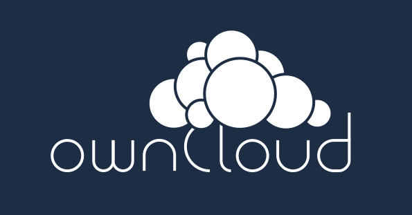
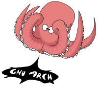

# Control de versiones con git 

--------------------------------------------------------------------------------

# Información del curso

## Nivel de especialización

Intermedio

## Objetivo

El alumno conocerá el sistema de control de versiones git y aprenderá el uso de esta herramienta tanto desde línea de comandos, como desde un cliente de escritorio y vía web a través de Github. 

--------------------------------------------------------------------------------

# Perfil del asistente

Estudiantes, pasantes o egresados de carreras afines a computación, desarrolladores y entusiastas de la programación.

## Conocimientos previos

+ Conocimientos básicos de GNU/Linux y Windows a nivel usuario
+ Uso de internet
+ Cuenta de correo electrónico
+ Conocimientos básicos de inglés a nivel técnico

--------------------------------------------------------------------------------

# Temario

1. Introducción a los sistemas de control de versiones
   1. Local
   2. Centralizado
   3. Distribuido

2. Introducción a git
   1. Inicializar un repositorio
   2. Agregar y borrar archivos
   3. Guardar cambios
   4. Enviar cambios al servidor

--------------------------------------------------------------------------------

# Temario (cont)

3. Configuración del cliente git
   1. Datos del usuario
   2. Reparar fin de línea en los archivos
   3. Ignorar espacios en blanco

4. Trabajando con repositorios existentes
   1. Clonar un repositorio existente
   2. Resolución de conflictos
   3. Corregir el commit anterior

--------------------------------------------------------------------------------

# Temario (cont 2)

5. Introducción a Github
   1. Crear una cuenta en Github
   2. Administración de repositorios via web
   3. Cliente gráfico de git para Mac y Windows
   4. Documentación en Markdown

6. Trabajo colaborativo en Github
   1. Fork
   2. Pull requests
   3. gist
   4. Github Pages
   5. Wikis

--------------------------------------------------------------------------------

# 1. Introducción a los sistemas de control de versiones

## Sistema de control de versiones

+ Guarda las versiones del código fuente de un programa
+ Permite mostrar los cambios en el código
+ Trabaja principalmente con archivos de texto
+ Asocia el cambio con el autor
+ Tiene la capacidad de regresar a versiones anteriores

--------------------------------------------------------------------------------

## 1.1. Local

### Guardar cambios en archivos separados

```
	prog.c prog1.c prog2.c ... prog<n>.c
```

### Guardar cambios en carpetas separadas

```
  tarea/prog.c
  version_inicial/prog.c
  modificado2/prog.c
  vers-28sep/prog.c
  ProyectoFinal_2017-1_completo(Andres)/prog1.c
```

--------------------------------------------------------------------------------

#### Desventajas del control de versiones local

+ Se tienen muchos archivos bastante similares
+ No se conoce cual es la última versión
+ Es necesario copiar el archivo de trabajo constantemente
+ Al modificar el archivo de trabajo se pierde la versión anterior
+ Cuando se borra el archivo de trabajo se pierde esa revisión

--------------------------------------------------------------------------------

### Enviar cambios por correo electrónico

+ Se genera un correo por cada versión enviada
+ Puede ser tedioso encontrar una versión anterior

  
  
  
  

--------------------------------------------------------------------------------

### Utilizar almacenamiento en la nube

+ Algunos servicios de almacenamiento en la nube permiten regresar a versiones anteriores
+ Muchos de los servicios gratuitos únicamente permiten un número finito de versiones anteriores
+ Algunas veces los servicios de almacenamiento quitan las versiones anteriores más antiguas

  
  
  
  
  
  

--------------------------------------------------------------------------------

## 1.2. Centralizado - CVCS

+ Se basa en un modelo *cliente-servidor*
+ El servidor tiene una copia de todas las versiones del código
+ Los clientes *clonan* el repositorio y tienen una *copia de trabajo* que pueden modificar
+ Cuando los cambios están listos, los clientes los envían al servidor
+ Si el servidor falla, se pierden todas las versiones del proyecto

  
  <br />
  

--------------------------------------------------------------------------------

## 1.3. Distribuido - DVCS

+ Cada cliente tiene una copia de todas las versiones del proyecto
+ Si el servidor falla es posible copiar todas las versiones desde un cliente
+ Es posible establecer estructuras jerárquicas

  
  
  
  
  

--------------------------------------------------------------------------------

# 2. Introducción a git

+ El desarrollo del kernel Linux entre los años 1991 - 2002 no utilizaba un control de versiones *per-se*
+ En 2002 se utilizó un DVCS propietario llamado BitKeeper, que se ofrecía sin costo a los miembros del proyecto
+ En 2005 la compañía quiso cobrar el uso del software
+ La comunidad de desarrolladores, incluyendo a Linus Torvalds, optó por desarrollar su propia herramienta

  
  <span style="font-size: 5em;">⇒<!--⇨--></span>
  

--------------------------------------------------------------------------------

### Características de git

+ Velocidad
+ Diseño simple
+ Soporte para múltiples ramas
+ Enfoque distribuido
+ Capacidad de alojar grandes proyectos
+ Varios desarrolladores pueden trabajar en el mismo proyecto

--------------------------------------------------------------------------------

## 2.1. Inicializar un nuevo repositorio

## 2.2. Agregar y borrar archivos

## 2.3. Guardar cambios

## 2.4. Enviar cambios al servidor

--------------------------------------------------------------------------------

# 3. Configuración del cliente git

## 3.1. Datos del usuario

## 3.2. Reparar fin de línea en los archivos

## 3.3. Ignorar espacios en blanco

--------------------------------------------------------------------------------

# 4. Trabajando con repositorios existentes

## 4.1. Clonar un repositorio existente

## 4.2. Resolución de conflictos

## 4.3. Corregir el commit anterior

--------------------------------------------------------------------------------

# 5. Introducción a Github

## 5.1. Crear una cuenta en Github

## 5.2. Administración de repositorios via web

## 5.3. Cliente gráfico de git para Mac y Windows

## 5.4. Documentación en Markdown

--------------------------------------------------------------------------------

# 6. Trabajo colaborativo en Github

## 6.1. Fork

## 6.2. Pull requests

## 6.3. gist

## 6.4. Github Pages

## 6.5. Wikis

--------------------------------------------------------------------------------

# Referencias

+ https://git-scm.com/docs
+ https://git-scm.com/book/en/v2
+ https://github.com/papadako/git-a-little-tale/

--------------------------------------------------------------------------------
<!-- zoom-out slide -->

